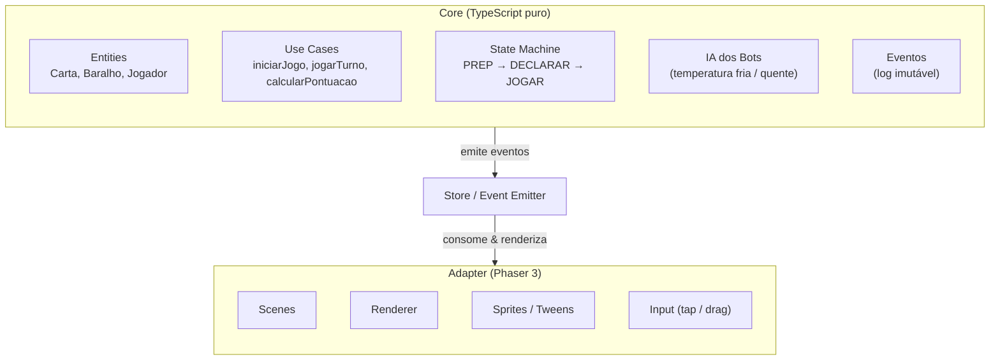
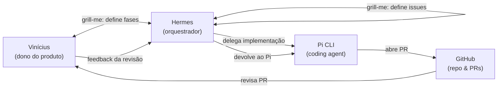

# Arquitetura do FDP

> Decisões arquiteturais do projeto FDP (Faz De Propósito).
> Este documento é resultado das sessões grill-me entre Hermes e Vinícius.
> Data da última revisão: 2026-04-23

---

## Visão Geral

Jogo de cartas brasileiro (baralho padrão de 52 cartas), gratuito, open-source, rodando no browser.

| Aspecto | Decisão |
|---|---|
| **Escopo do MVP** | Single-player contra bots (IA com temperatura) |
| **Multiplayer** | Não no MVP. Arquitetura pronta para substituir a camada de transporte no futuro |
| **Público** | Mobile-first, PWA instalável |
| **Idiomas** | PT-BR (código + docs), EN e ES (interface) |

---

## Stack

| Camada | Ferramenta | Motivação |
|---|---|---|
| Linguagem | TypeScript | Tipagem estática, DX |
| Build | Vite | Rápido, HMR, TS nativo, integração com Vercel |
| Package manager | pnpm | Mais rápido que npm/yarn |
| Game engine | Phaser 3 | Padrão de mercado para jogos 2D no browser, ecossistema maduro |
| Testes unitários | Vitest | TS nativo, rápido, integrado com Vite |
| Testes E2E | Playwright | Maturidade, screenshots de regressão, interação com canvas |
| CI/CD | GitHub Actions + Vercel | Testes antes de deploy |

---

## Arquitetura em Camadas (Ports & Adapters / Clean Architecture)

O core do jogo **não sabe que o Phaser existe**. Isso permite trocar a engine no futuro sem reescrever regras.



### Estrutura de Pastas

```
src/
  core/              ← Regras puras do FDP (sem Phaser!)
    entities/        ← Carta, Baralho, Jogador, EstadoJogo
    use-cases/       ← iniciarJogo, jogarTurno, calcularPontuacao
    events/          ← Tipos de eventos (CARTA_JOGADA, FASE_MUDOU, etc.)
    state-machine/   ← Fases do jogo (PREP, DECLARAR, JOGAR)
  adapters/
    phaser/          ← Tudo que toca Phaser
      scenes/        ← BootScene, GameScene, UIScene
      renderers/     ← Desenha cartas, anima jogadas
      input/         ← Toque, clique
    bots/            ← IA com temperatura (injetada no core)
  store/             ← Event Emitter + estado reativo
  types/             ← Tipos compartilhados
tests/
  core/              ← Vitest: regras puras
  e2e/               ← Playwright: fluxo completo
```

---

## Estado e Eventos

- **Store reativa simples com Event Emitter custom.**
- O core emite eventos imutáveis; o adapter consome e renderiza.
- No futuro multiplayer, o host emite os mesmos eventos pela rede.

Eventos principais:
- `JOGO_INICIADO`
- `MANILHA_VIRADA`
- `DECLARACAO_FEITA`
- `CARTA_JOGADA`
- `TURNO_GANHO`
- `RODADA_ENCERRADA`
- `JOGO_ENCERRADO`

---

## IA dos Bots

- **Heurística + aleatoriedade (temperatura).**
- "Frio" = sempre a jogada mais conservadora.
- "Quente" = arrisca mais (blefa, força adversário, espera).
- Detalhes do algoritmo serão definidos na implementação.

---

## Testes

### Estratégia de 3 Camadas

| Camada | Ferramenta | O que testa |
|---|---|---|
| **Unitário** | Vitest | Core puro (regras, state machine, eventos) |
| **E2E fluxo** | Playwright | 1 fluxo completo determinístico com seed fixa |
| **Regressão visual** | Playwright screenshots | Canvas em momentos chave |

### TDD

- **Core**: TDD desde o início (slices verticais: 1 teste → 1 implementação → repete).
- **Adapter**: não TDD. Testes via E2E e screenshots.

### Seed Fixa nos Testes E2E

`VITE_TEST_SEED=1337` garante reprodutibilidade (mesmo baralho, mesma sequência).

---

## Qualidade de Código

| Ferramenta | Regra / Propósito |
|---|---|
| **ESLint + typescript-eslint** | Complexidade máxima: 10, arquivo máx: 200 linhas, função máx: 30 linhas, parâmetros máx: 3 |
| **Prettier** | Formatação automática |
| **Knip** | Detecta dependências e código morto |
| **Dependabot** | Atualiza dependências automaticamente (PRs) |
| **Husky + lint-staged** | Pre-commit: Prettier + ESLint + typecheck + testes |

---

## Assets e Interface

| Aspecto | Decisão |
|---|---|
| **Sprites** | Assets gratuitos do Kenney (escolhidos na implementação) |
| **Estilo fallback** | Minimalista programático (retângulos, texto, cores) enquanto assets não estão prontos |
| **Interação** | Tap para selecionar carta → tap na mesa/botão para jogar (mobile-first) |
| **Som** | SFX simples (clique, distribuir, virar manilha, vitória). Sem música ambiente no MVP |
| **Persistência** | localStorage (estatísticas + preferências) |

---

## PWA

- Manifest JSON e service worker via Vite PWA plugin.
- Instalável no celular, ícone na home screen.

---

## Workflow de Desenvolvimento



1. **Sessões grill-me** entre Vinícius e Hermes definem fases e issues.
2. **Hermes** orquestra o Pi CLI para implementar cada issue.
3. **Pi** abre PRs no GitHub.
4. **Vinícius** revisa PRs diretamente no GitHub.
5. **Hermes** recebe feedback e devolve ao Pi.

---

## Fases do MVP (Opção B — Entregáveis Verticais)

Cada fase entrega uma experiência jogável, ainda que incompleta. Isso permite validar o Phaser cedo e "errar rápido" com a stack.

| Fase | Nome | O que entrega | O que valida |
|------|------|---------------|--------------|
| **0** | Infraestrutura | Vite + TS + Phaser + Vitest + ESLint + Prettier. Quadrado na tela. | A stack funciona end-to-end |
| **1** | Toque e Resposta | Quadrado vira carta ao tocar. Som ao tocar. Menu inicial básico. | O Phaser responde ao input mobile |
| **2** | Loop Mecânico | 1 rodada: embaralha, distribui, joga 1 carta cada, maior carta ganha. Sem declaração, sem manilha, sem pontos. | O core aguenta o ciclo básico de turnos |
| **3** | Regras Completas | Adiciona: declaração (Turno 0), manilha, hierarquia (valores + naipes), pontuação `|declarado − feito|`, eliminação (≤0), regra especial da 1ª rodada (não vê própria carta), reinício em N=1 quando cai alguém. | O core aguenta as regras reais do FDP |
| **4** | Bots com Temperatura | 3 bots. Frio (conservador, joga o mínimo pra ganhar) vs Quente (arrisca). Não mais aleatório. | A arquitetura de IA é extensível |
| **5** | UI/UX e Polimento | Animações de carta, SFX (Kenney), menu inicial, tela de fim de jogo, escolha de avatar, transições. | O adapter Phaser resiste à complexidade visual |
| **6** | PWA e Persistência | Service worker, offline, localStorage de estatísticas, instalação no celular, ícone. | A entrega funciona fora do desktop |

**Por que Opção B:** cada fase dá dopamina — você sempre tem algo pra mostrar. O risco é "vazar" lógica pro adapter. Contraímos isso com **Regras Fortalecidas** (abaixo).

---

## Regras Fortalecidas (Core vs Adapter)

A Opção B só funciona se estas regras forem seguidas **sem exceção** desde a Fase 1:

### 1. Regra de Ouro
O adapter **NUNCA decide regras**. Ele apenas renderiza o estado que o core entrega. Se o adapter precisar saber "quem ganhou a rodada" pra mostrar uma coroa, o core já deve ter `vencedorDaRodada: string` no estado público. O adapter **não calcula** isso.

### 2. Regra do Contrato
Toda informação que o adapter precisa **DEVE** passar pelo estado público do core. Se faltar algo, você **adiciona ao core** (com teste), não "fuça" pelo adapter.

### 3. Regra da Mentira Visual
O adapter pode "mentir" visualmente (animação de carta virando, som, partículas) sem que o core saiba. Isso é permitido e é o que dá a dopamina da Opção B. Mas a **mentira nunca muda o estado do jogo**.

### 4. Regra do Teste de Fuga
Se você sentir vontade de testar algo através do Phaser (ex: "vou abrir o browser pra ver se a carta responde ao clique"), **pare**. Isso é sintoma de lógica vazada pro adapter. O teste deve ser no core. O clique no Phaser apenas chama `core.jogarCarta()`.

---

## Decisões Arquiteturais Rejeitadas

| Alternativa | Motivo da rejeição |
|---|---|
| Multiplayer no MVP | Overhead de anti-cheat e sinalização P2P. Arquitetura já permite adicionar depois |
| Framework UI (React/Vue) | Overkill para jogo de cartas. Phaser já gerencia input e renderização |
| ECS no core | Overkill para entidades contáveis (52 cartas + 4 jogadores). ECS fica para próximo jogo |
| IndexedDB | localStorage é suficiente para estatísticas e preferências |
| MCTS/MiniMax para bots | Informação parcial + embaralhamento torna custo computacional não justificável |
