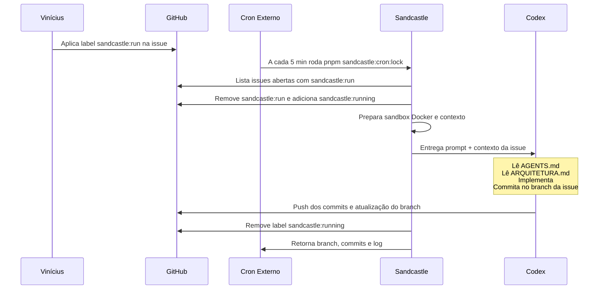

# Orquestração do Sandcastle

> Estado atual do fluxo automatizado do Sandcastle no FDP.

---

## Visão Geral

| Entidade       | Função                                                                                                          |
| -------------- | --------------------------------------------------------------------------------------------------------------- |
| **Vinícius**   | Dono do produto. Revisa PRs direto no GitHub.                                                                   |
| **Hermes**     | Papel ainda em definição. O workflow oficial do Hermes será documentado no futuro.                              |
| **Sandcastle** | Executor do agente. Sobe sandbox Docker, cria branch isolada e roda o agente configurado com prompt controlado. |
| **Codex / Pi** | Agentes de execução suportados no cron atual.                                                                   |
| **GitHub**     | Repo, issues, PRs e labels. Fonte da verdade.                                                                   |

---

## Escopo Deste Documento

- Este documento descreve apenas o fluxo atual do Sandcastle.
- O papel do Hermes no processo ainda não está fechado e não deve ser inferido a partir deste arquivo.
- Sempre que houver conflito entre este documento e a implementação em `.sandcastle/`, a implementação atual prevalece até a documentação ser atualizada.

---

## Fluxo Atual no Repositório

Hoje o fluxo automatizado usa a pasta `.sandcastle/`, os scripts do `package.json` e um cron externo executado a cada **5 minutos**.

### Seleção de issues

- A cada 5 minutos, o cron dispara uma nova rodada do Sandcastle.
- O cron busca issues abertas com a label `sandcastle:run`.
- Antes da execução, adiciona `sandcastle:running` e remove `sandcastle:run`.
- Em cada rodada, processa no máximo **3 issues**, priorizando as mais antigas.

### Branch de execução

- Cada issue roda em um branch isolado no formato `sandcastle-issue-<id>`.
- O branch é criado pelo próprio Sandcastle via `branchStrategy`.

### Prompt do agente

- O prompt base fica em `.sandcastle/prompts/agente.md`.
- O cron injeta no prompt:
  - contexto da issue
  - labels atuais
  - até 5 comentários recentes

### Configuração do agente e overrides

O agente ativo é definido pela variável `SANDCASTLE_AGENT`. Valores suportados: `codex` e `pi`. Padrão: `codex`.

Alternar entre agentes não exige mudança de código: basta ajustar o valor em `.sandcastle/.env` (ou no ambiente do host) antes de rodar o cron.

| Agente    | Modelo padrão             | Esforço padrão | Autenticação                               |
| --------- | ------------------------- | -------------- | ------------------------------------------ |
| **Codex** | `gpt-5.4`                 | `low`          | `codex login` no host, ou `OPENAI_API_KEY` |
| **Pi**    | `opencode-go/mimo-v2-pro` | `medium`       | `OPENCODE_API_KEY` (obrigatória)           |

Overrides de modelo e esforço são aplicados por variáveis de ambiente, sem alterar código:

- Codex: `SANDCASTLE_CODEX_MODEL` e `SANDCASTLE_CODEX_EFFORT` (`low` | `medium` | `high` | `xhigh`)
- Pi: `SANDCASTLE_PI_MODEL` e `SANDCASTLE_PI_EFFORT` (`off` | `minimal` | `low` | `medium` | `high` | `xhigh`)

O preflight valida apenas o agente ativo: se `SANDCASTLE_AGENT=pi`, a autenticação do Codex não é verificada (e vice-versa).

---

## Comandos

### 1. Build da imagem Docker

```bash
pnpm sandcastle:build
```

Cria a imagem `sandcastle:fdp-online`, exigida antes de qualquer execução do cron.

### 2. Rodar o cron diretamente

```bash
pnpm sandcastle:cron
```

Esse comando:

1. Carrega `.sandcastle/.env`, se existir.
2. Valida `gh auth status`.
3. Valida Docker e a imagem `sandcastle:fdp-online`.
4. Valida apenas a autenticação do agente ativo configurado em `SANDCASTLE_AGENT`.
5. Busca issues candidatas no GitHub e executa o agente.

Veja a seção [Configuração do agente e overrides](#configuração-do-agente-e-overrides) para as variáveis suportadas.

### 3. Rodar o cron com lock e branch protegida

```bash
pnpm sandcastle:cron:lock
```

Esse wrapper:

1. Exige branch atual `main` por padrão.
2. Exige árvore git limpa.
3. Faz `git fetch` + `git pull --ff-only` da branch base.
4. Executa o cron com `flock`.
5. Aplica timeout de `30m`.

Variáveis suportadas:

- `SANDCASTLE_LOCK`: caminho do arquivo de lock. Padrão: `/tmp/fdp-sandcastle.lock`
- `SANDCASTLE_TIMEOUT`: timeout total da execução. Padrão: `30m`
- `SANDCASTLE_BRANCH_BASE`: branch obrigatória para iniciar o cron. Padrão: `main`

### 4. Rodar em dry run

```bash
pnpm sandcastle:cron -- --dry-run
```

Mostra quais issues seriam enviadas ao agente sem executar sandbox, sem criar branch e sem alterar labels.

Nesse modo, o preflight valida `gh`, Docker e a imagem `sandcastle:fdp-online`, mas **não** valida a autenticação do agente ativo. Isso permite inspecionar a fila mesmo sem credenciais do Codex ou do Pi configuradas.

---

## Estrutura Atual

```text
.sandcastle/
  .env                     ← variáveis locais do cron
  .env.example             ← modelo de configuração
  Dockerfile               ← imagem usada pelo sandbox
  execucao-sandcastle.ts   ← integração com Sandcastle/Codex
  run.ts                   ← entrada principal acionada por `pnpm sandcastle:run`
  runner.ts                ← orquestra fila, validações e execução dos adaptadores
  github/
    issue.ts               ← leitura e edição de issues e labels via gh
  prompts/
    agente.md              ← prompt base do agente
  rodar-cron-com-lock.sh   ← wrapper com lock, timeout e validações
```

---

## Fluxo Completo



---

## Pré-requisitos

- `gh` instalado e autenticado.
- **Para Codex**: `codex login` feito no host, ou `OPENAI_API_KEY` definido em `.sandcastle/.env`.
- **Para Pi**: `OPENCODE_API_KEY` definida em `.sandcastle/.env`.
- Docker funcional.
- Imagem `sandcastle:fdp-online` criada com `pnpm sandcastle:build`.

---

## Notas Operacionais

- O cron escreve o resultado no stdout e pode retornar `logFilePath` ao final da execução.
- O sandbox injeta `GH_TOKEN` e `GITHUB_TOKEN` se `GITHUB_TOKEN` estiver presente no ambiente host.
- Dependências são instaladas no sandbox com `pnpm install --frozen-lockfile --prefer-offline`.
- Se `~/.docker/config.json` usar `credsStore: "desktop.exe"` em WSL/Linux, a execução é bloqueada preventivamente.
- Se não houver issues com `sandcastle:run`, o cron encerra sem erro.

---

## Próximos Passos

1. Definir futuramente o papel do Hermes no processo e documentá-lo sem misturar com o fluxo atual do Sandcastle.
2. Documentar a política de criação de PR pelo agente quando esse fluxo estiver estável.
3. Adicionar cleanup explícito de branches e estratégia de retry, se isso virar necessidade real.
