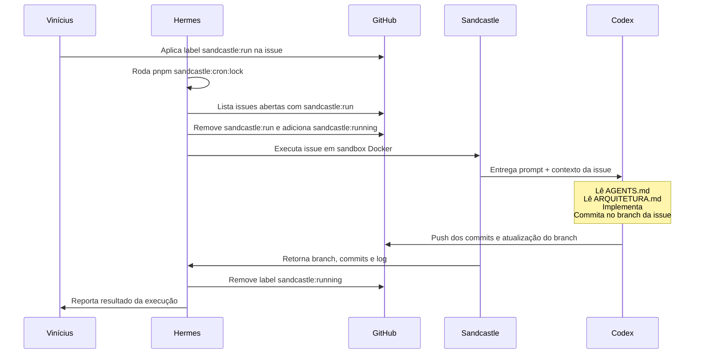

# Orquestração do Sandcastle

> Como o Hermes orquestra o Sandcastle para implementar issues e revisões do FDP.

---

## Visão Geral

| Entidade       | Função                                                                                             |
| -------------- | -------------------------------------------------------------------------------------------------- |
| **Vinícius**   | Dono do produto. Revisa PRs direto no GitHub.                                                      |
| **Hermes**     | Orquestrador. Prepara ambiente, dispara o cron, monitora resultado e reporta ao Vinícius.          |
| **Sandcastle** | Executor do agente. Sobe sandbox Docker, cria branch isolada e roda o Codex com prompt controlado. |
| **Codex**      | Coding agent que implementa código, cria commits e atualiza o branch da issue.                     |
| **GitHub**     | Repo, issues, PRs e labels. Fonte da verdade.                                                      |

---

## Fluxo Real no Repositório

Hoje o fluxo automatizado usa a pasta `.sandcastle/` e os scripts do `package.json`.

### Seleção de issues

- O cron busca issues abertas com a label `sandcastle:run`.
- Antes da execução, adiciona `sandcastle:running` e remove `sandcastle:run`.
- Em cada rodada, processa no máximo **3 issues**, priorizando as mais antigas.

### Branch de execução

- Cada issue roda em um branch isolado no formato `sandcastle-issue-<id>`.
- O branch é criado pelo próprio Sandcastle via `branchStrategy`.

### Prompt do agente

- O prompt base fica em `.sandcastle/prompts/agente.md`.
- O cron injeta no prompt:
  - contexto da issue
  - labels atuais
  - até 5 comentários recentes

---

## Comandos

### 1. Build da imagem Docker

```bash
pnpm sandcastle:build
```

Cria a imagem `sandcastle:fdp-online`, exigida antes de qualquer execução do cron.

### 2. Rodar o cron diretamente

```bash
pnpm sandcastle:cron
```

Esse comando:

1. Carrega `.sandcastle/.env`, se existir.
2. Valida `gh auth status`.
3. Valida autenticação do Codex (`OPENAI_API_KEY` ou `~/.codex/auth.json`).
4. Valida Docker e a imagem `sandcastle:fdp-online`.
5. Busca issues candidatas no GitHub e executa o agente.

### 3. Rodar o cron com lock e branch protegida

```bash
pnpm sandcastle:cron:lock
```

Esse wrapper:

1. Exige branch atual `main` por padrão.
2. Exige árvore git limpa.
3. Faz `git fetch` + `git pull --ff-only` da branch base.
4. Executa o cron com `flock`.
5. Aplica timeout de `30m`.

Variáveis suportadas:

- `SANDCASTLE_LOCK`: caminho do arquivo de lock. Padrão: `/tmp/fdp-sandcastle.lock`
- `SANDCASTLE_TIMEOUT`: timeout total da execução. Padrão: `30m`
- `SANDCASTLE_BRANCH_BASE`: branch obrigatória para iniciar o cron. Padrão: `main`

### 4. Rodar em dry run

```bash
pnpm sandcastle:cron -- --dry-run
```

Mostra quais issues seriam enviadas ao agente sem executar sandbox, sem criar branch e sem alterar labels.

---

## Estrutura Atual

```text
.sandcastle/
  .env                     ← variáveis locais do cron
  .env.example             ← modelo de configuração
  Dockerfile               ← imagem usada pelo sandbox
  execucao-sandcastle.ts   ← integração com Sandcastle/Codex
  github-gh.ts             ← leitura e edição de issues via gh
  main.ts                  ← entrada principal do cron
  prompts/
    agente.md              ← prompt base do agente
  rodar-cron-com-lock.sh   ← wrapper com lock, timeout e validações
```

---

## Fluxo Completo



---

## Pré-requisitos

- `gh` instalado e autenticado.
- `codex login` feito, ou `OPENAI_API_KEY` definido em `.sandcastle/.env`.
- Docker funcional.
- Imagem `sandcastle:fdp-online` criada com `pnpm sandcastle:build`.

---

## Notas Operacionais

- O cron escreve o resultado no stdout e pode retornar `logFilePath` ao final da execução.
- O sandbox injeta `GH_TOKEN` e `GITHUB_TOKEN` se `GITHUB_TOKEN` estiver presente no ambiente host.
- Dependências são instaladas no sandbox com `pnpm install --frozen-lockfile --prefer-offline`.
- Se `~/.docker/config.json` usar `credsStore: "desktop.exe"` em WSL/Linux, a execução é bloqueada preventivamente.
- Se não houver issues com `sandcastle:run`, o cron encerra sem erro.

---

## Próximos Passos

1. Separar este documento em runbook operacional e decisões históricas, se a complexidade crescer.
2. Documentar a política de criação de PR pelo agente quando esse fluxo estiver estável.
3. Adicionar cleanup explícito de branches e estratégia de retry, se isso virar necessidade real.
