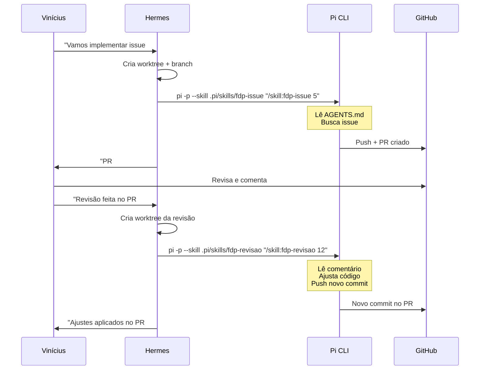

# Orquestração do Pi CLI

> Como o Hermes orquestra o Pi CLI para implementar issues e revisões do FDP.

---

## Visão Geral

| Entidade | Função |
|----------|--------|
| **Vinícius** | Dono do produto. Revisa PRs direto no GitHub. |
| **Hermes** | Orquestrador. Prepara workspace, dispara Pi, monitora progresso, reporta ao Vinícius. |
| **Pi CLI** | Coding agent. Implementa código, abre PRs, aplica revisões. Autônomo. |
| **GitHub** | Repo, issues, PRs, CI. Fonte da verdade. |

---

## Comandos do Pi

O Pi está instalado via nvm e configurado com **kimi2.5**.

### 1. Implementar Issue

```bash
cd <worktree>
pi -p --skill .pi/skills/fdp-issue "/skill:fdp-issue <id>"
```

O Pi:
1. Lê `AGENTS.md` (automático, está no diretório).
2. Busca a issue no GitHub.
3. Implementa seguindo arquitetura e regras.
4. Roda testes.
5. Commita e abre PR via `gh pr create`.

### 2. Revisar PR

```bash
cd <worktree-original-ou-novo>
pi -p --skill .pi/skills/fdp-revisao "/skill:fdp-revisao <pr-id>"
```

O Pi:
1. Lê o comentário de revisão no PR.
2. Ajusta o código.
3. Pusha novo commit no mesmo PR.

---

## Gerenciamento de Workspace (Hermes)

```
.pi/
  worktrees/
    issue-5/         ← worktree isolado para issue #5
  logs/
    issue-5.log      ← stdout do Pi
  pids/
    issue-5.pid      ← PID do processo Pi
```

### Script de Orquestração (Hermes)

```bash
# 1. Criar branch e worktree
BRANCH="feat/issue-$ISSUE_ID"
git checkout -b "$BRANCH"
git worktree add .pi/worktrees/issue-$ISSUE_ID "$BRANCH"

# 2. Disparar Pi em background
cd .pi/worktrees/issue-$ISSUE_ID
pi -p --skill .pi/skills/fdp-issue "/skill:fdp-issue $ISSUE_ID" \
   > ../../logs/issue-$ISSUE_ID.log 2>&1 &
echo $! > ../../pids/issue-$ISSUE_ID.pid

# 3. Monitorar
# Hermes verifica periodicamente se o PID ainda existe.
# Quando o processo morre, extrai o resultado do log.
```

---

## Fluxo Completo



---

## Skills do Pi

As skills ficam em `.pi/skills/` dentro do repo:

```
.pi/skills/
  fdp-issue/
    SKILL.md        ← Instruções para implementar issues
  fdp-revisao/
    SKILL.md        ← Instruções para aplicar revisões
```

---

## Notas

- O Pi **não sabe que o Hermes existe**. Ele recebe um prompt e executa.
- O Hermes **não acompanha em tempo real**. Só verifica logs/PIDs quando perguntado.
- Vinícius **revisa PRs direto no GitHub**, sem intermediário.
- Se o Pi travar ou der erro, o log em `.pi/logs/` é a fonte de debug.

---

## Próximos Passos

1. ~~Criar `AGENTS.md` na raiz do projeto.~~ ✅ Feito.
2. ~~Criar skills `fdp-issue` e `fdp-revisao`.~~ ✅ Feitas.
3. ~~Testar fluxo end-to-end com uma issue simples.~~ ✅ Issue #1 (Fase 0) implementada e revisada.
4. Evoluir o `ORQUESTRACAO.md` conforme novos aprendizados (ex: redirecionamento de logs, worktree cleanup, timeouts).
